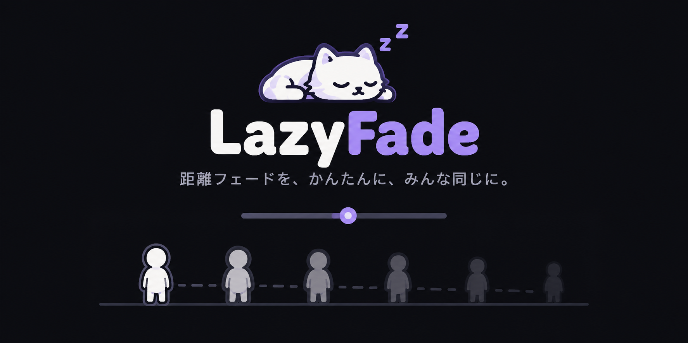

VRChatアバターの距離フェードを、NDMFビルド時にまとめて設定するUnity Editor拡張。\
元マテリアルは変更しない。

## 依存関係
- Unity 2022.3f22
- SDK Avatars
- NDMF
- liltoon または shadercore + nontoon

## 導入・使い方

1. 必要な依存パッケージを導入、VPMに以下を登録し追加
```
https://cameiiian.github.io/lazyFade/index.json
```
2. アバターのルート(VRC Avatar Descriptorと同じ位置)に
```
Add Component → lazyFade → lazyFade XXX
```

詳しい導入・操作は[利用者向けガイド](https://cameiiian.github.io/lazyFade/)、開発情報は[技術文書の目次](docs/README.md)を参照。

## 免責
liltoon, shadercore公式の機能で無いため、アップデートによって問題が発生する場合があります。\
問題があればissueページ及び各種連絡先までどうぞ。

本ツールは[MITライセンス](LICENSE)です。

## 予定
- poiToon / poiPro 同機能
- 保守
